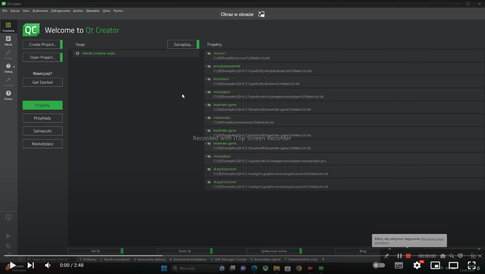
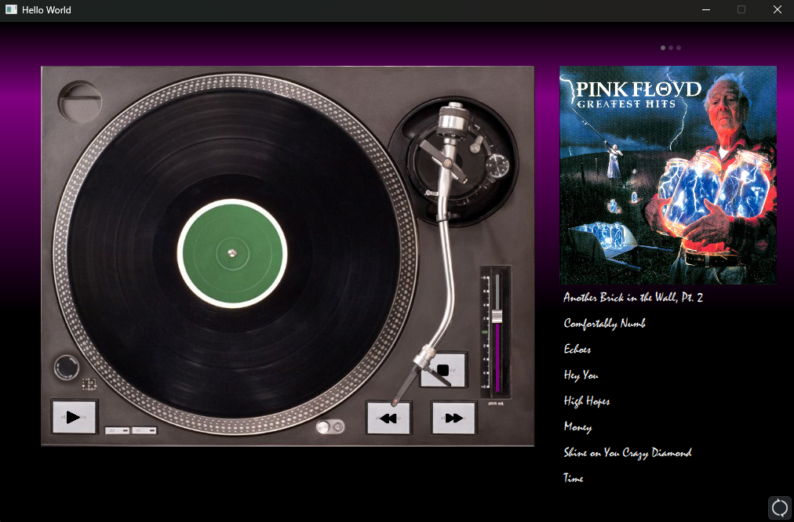
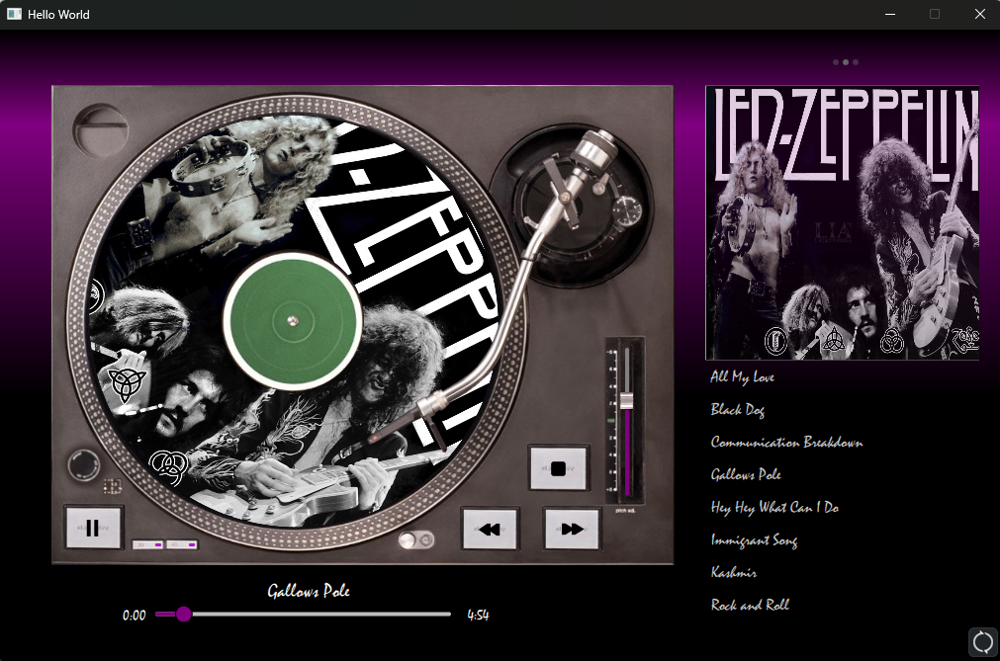
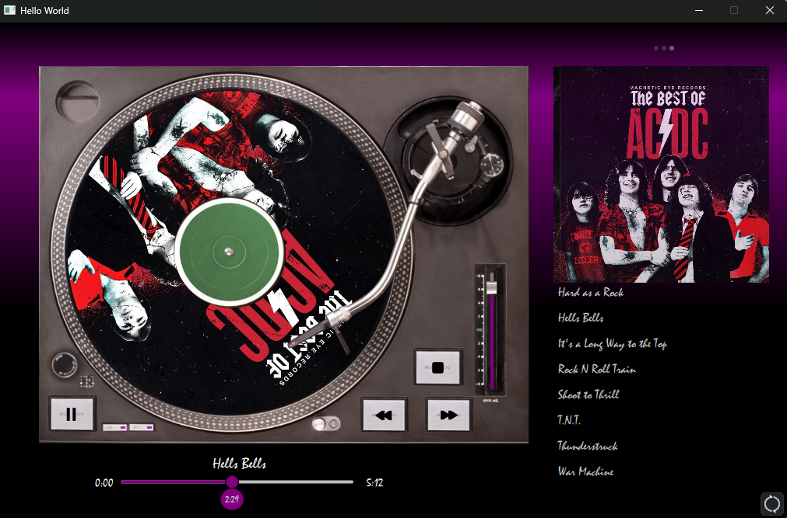
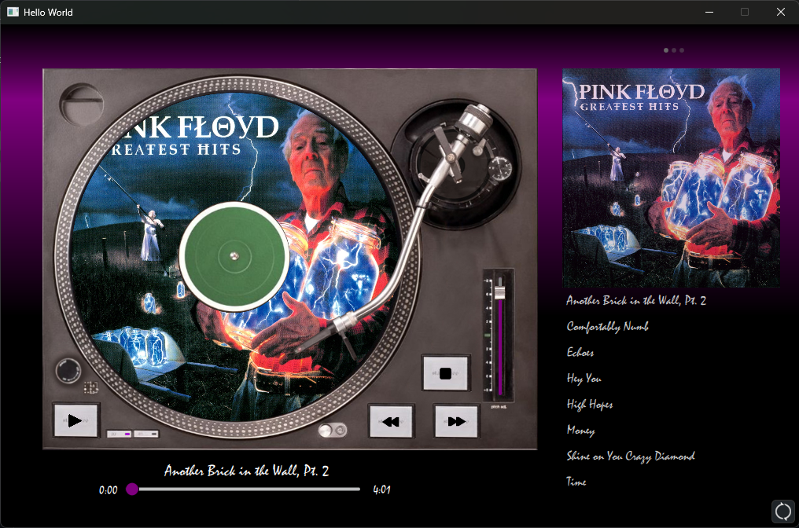

# AlbumPlayerQT - by Krzuch

Simple Album/Music Player made in QT Creator.

Project made by myself using QML and some C++ code.

### Authors: 

Krzysztof N (https://github.com/KrzucH)

## Application video:

https://www.youtube.com/watch?v=JFIHc3mh8-E

## Pictures

## How to compile and run

Program is working by using local directions of music!!!
This is ver1 of program so is still something to do :)

